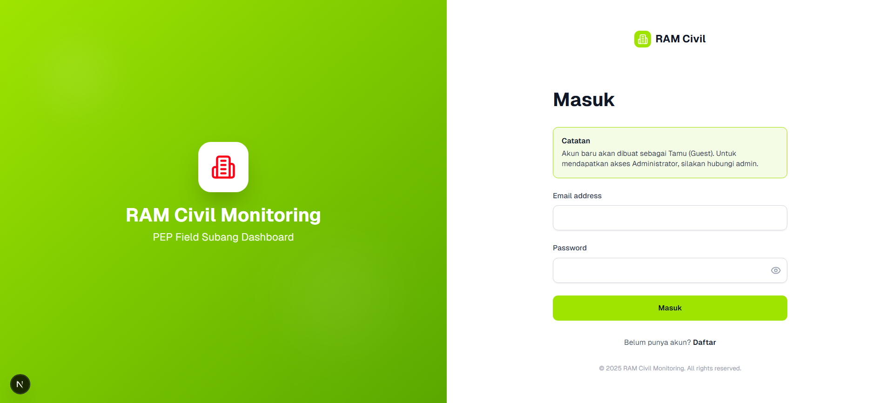
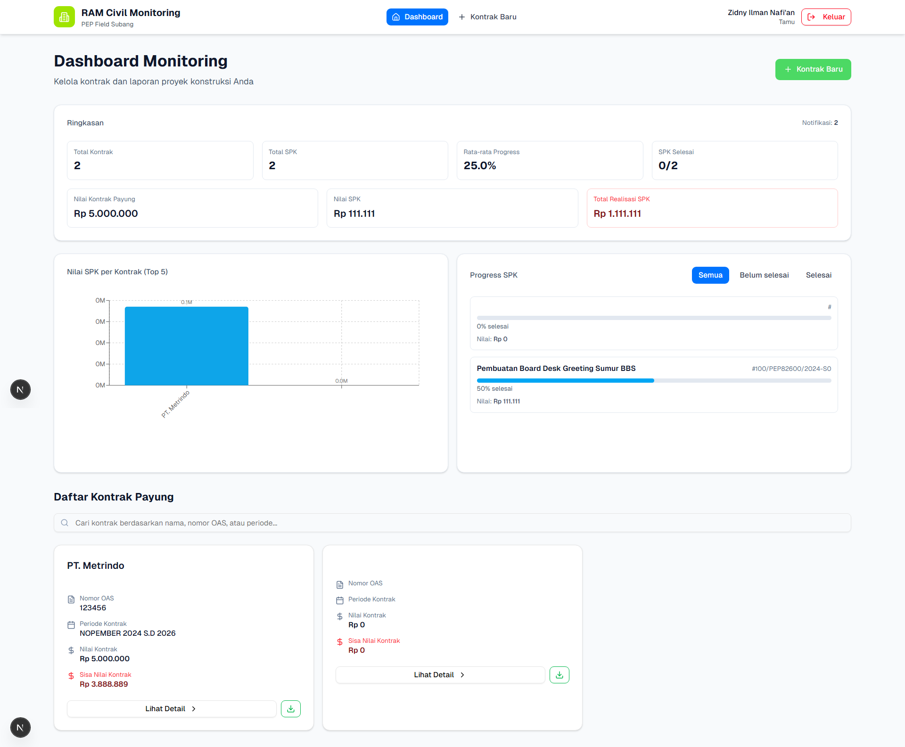
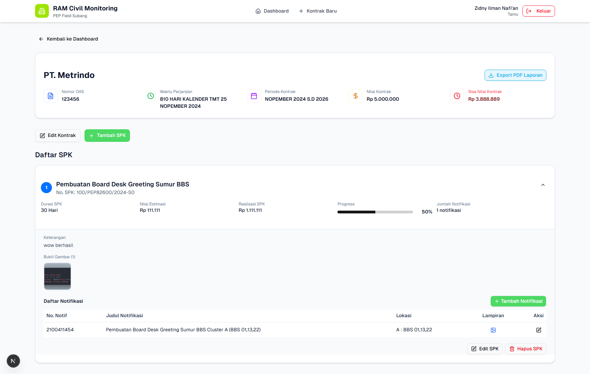
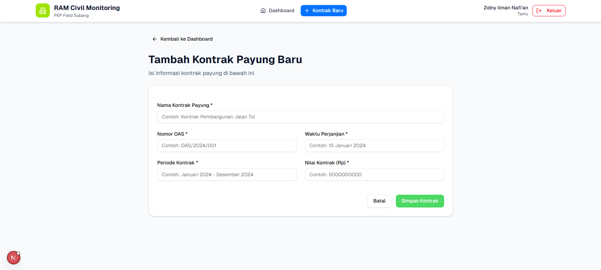
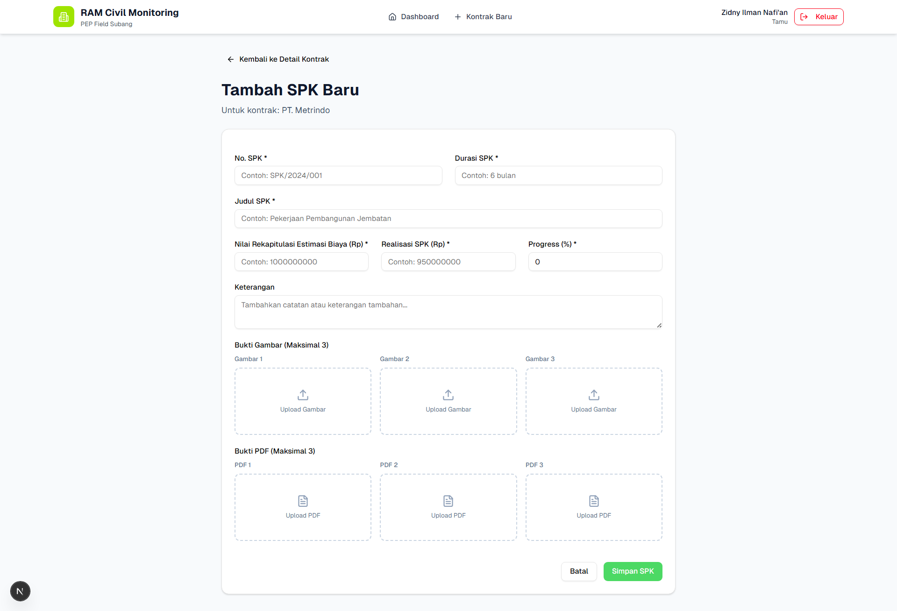
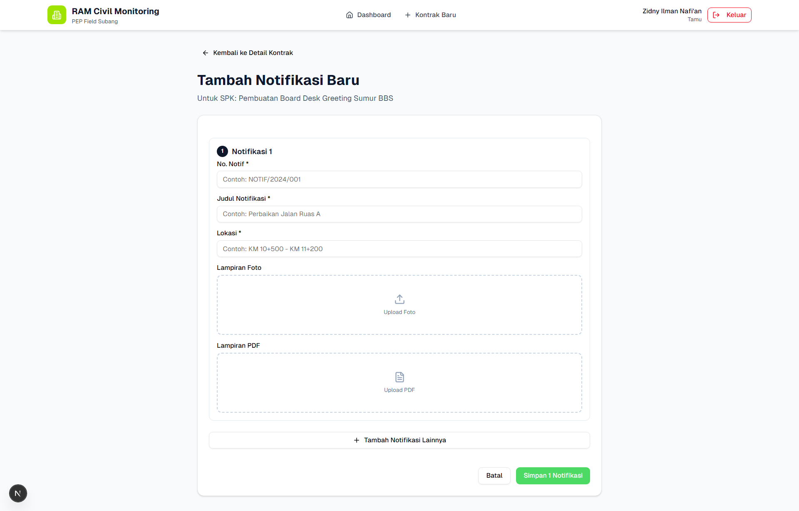
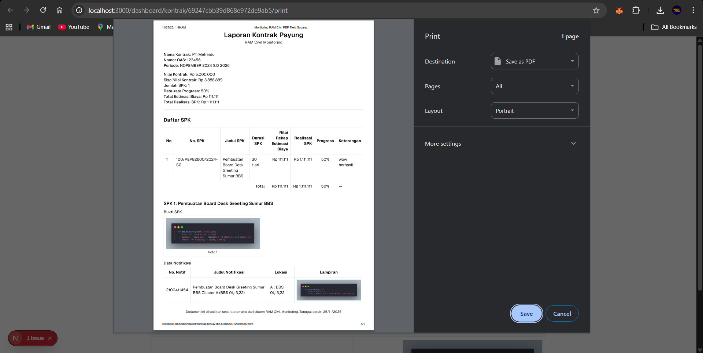

# Aplikasi Monitoring RAM Civil

Aplikasi web yang dirancang untuk mempermudah proses monitoring dan manajemen pekerjaan kontraktor. Proyek ini mendigitalisasi alur kerja manual, mulai dari pengelolaan kontrak utama (Kontrak Payung) hingga surat perintah kerja (SPK) yang lebih spesifik, serta menyediakan visualisasi data untuk pengambilan keputusan yang lebih cepat.

## 📝 Masalah yang Diselesaikan (Problem Statement)

Dalam metode kerja konvensional, proses monitoring kontraktor seringkali menghadapi tantangan seperti:

-   **Pelacakan Manual yang Lambat:** Membutuhkan banyak waktu untuk memeriksa progres setiap SPK satu per satu dari tumpukan dokumen atau file spreadsheet yang terpisah.
-   **Risiko Kehilangan Dokumen:** Dokumen fisik seperti Kontrak Payung dan SPK rentan hilang atau rusak, yang menyulitkan proses audit dan pelacakan riwayat pekerjaan.
-   **Kontrol Anggaran yang Rumit:** Sulit mendapatkan gambaran cepat mengenai total nilai SPK yang telah berjalan dibandingkan dengan total anggaran pada Kontrak Payung.
-   **Tidak Terpusat:** Informasi tersebar di banyak tempat, sehingga tidak ada satu sumber kebenaran (single source of truth) untuk seluruh data proyek.

## 💡 Solusi yang Dibuat (Solution Overview)

Aplikasi ini hadir sebagai solusi digital terpusat untuk mengatasi masalah-masalah di atas dengan menyediakan:

-   **Platform Terpusat:** Semua data terkait kontrak dan SPK tersimpan aman di satu tempat dan dapat diakses dari mana saja melalui web.
-   **Struktur Data Hierarkis:** Mengelola hubungan antara Kontrak Payung sebagai induk dan SPK sebagai turunan, mereplikasi alur kerja nyata secara digital.
-   **Dashboard Interaktif:** Menyajikan ringkasan dan statistik kunci melalui visualisasi data (grafik) untuk memantau progres anggaran dan pekerjaan secara sekilas.
-   **Digitalisasi Dokumen:** Mengubah dokumen fisik menjadi data digital yang mudah dicari, dikelola, dan dicetak kembali jika diperlukan.

## 🚀 Tech Stack & Fitur Utama

### Teknologi yang Digunakan

-   **Framework:** [Next.js](https://nextjs.org/) (React)
-   **Bahasa:** [TypeScript](https://www.typescriptlang.org/)
-   **Database:** [MongoDB](https://www.mongodb.com/)
-   **Autentikasi:** [Supabase](https://supabase.io/) (Auth)
-   **Storage:** [Supabase](https://supabase.io/)
-   **UI/Styling:** [Tailwind CSS](https://tailwindcss.com/) & [shadcn/ui](https://ui.shadcn.com/)
-   **Package Manager:** [pnpm](https://pnpm.io/)

### Fitur Utama

-   **🔐 Autentikasi Pengguna:** Sistem login yang aman untuk memastikan hanya pengguna terotorisasi yang dapat mengakses data.
-   **📊 Dashboard Monitoring:** Halaman utama yang menampilkan statistik kunci, grafik progres anggaran, dan ringkasan pekerjaan.
-   **🗂️ Manajemen Kontrak Payung:** Fitur untuk menambah, melihat, mengubah, dan menghapus (CRUD) data Kontrak Payung.
-   **📂 Manajemen SPK:** Fitur CRUD untuk Surat Perintah Kerja (SPK) yang terhubung langsung ke Kontrak Payung masing-masing.
-   **📈 Visualisasi Data:** Grafik interaktif untuk memvisualisasikan perbandingan anggaran dan realisasi.
-   **🔔 Sistem Notifikasi:** Modul untuk mencatat dan mengelola notifikasi atau catatan penting terkait SPK.
-   **📄 Ekspor & Cetak Laporan:** Kemampuan untuk menghasilkan dokumen (misalnya dalam format PDF) untuk keperluan pelaporan.

## 📸 Dokumentasi

Berikut adalah tata letak untuk beberapa tampilan utama dari aplikasi.

### Halaman Login & Register



### Dashboard Utama


### Detail Kontrak & Daftar SPK


### Form Input (Contoh: Tambah SPK Baru)




### Fitur Print


## ⚙️ Cara Menjalankan Proyek (Setup Instructions)

Ikuti langkah-langkah berikut untuk menjalankan proyek ini di lingkungan lokal Anda.

### Prasyarat

-   [Node.js](https://nodejs.org/) (v18 atau lebih baru)
-   [pnpm](https://pnpm.io/installation) terinstal secara global
-   Akses ke database [MongoDB](https://www.mongodb.com/try/download/community)
-   Proyek [Supabase](https://supabase.com/) untuk kredensial autentikasi

### Instalasi

1.  **Clone repository ini:**
    ```bash
    git clone <URL_repo_Anda>
    cd nama-folder-proyek
    ```

2.  **Install dependensi proyek:**
    ```bash
    pnpm install
    ```

3.  **Konfigurasi Environment Variable:**
    Buat file `.env.local` di root proyek dengan menyalin dari `.env.local.example` (jika ada) atau buat baru. Isi dengan kredensial yang sesuai.
    ```env
    # URL Proyek Supabase Anda
    NEXT_PUBLIC_SUPABASE_URL="https://xxxxxxxx.supabase.co"
    # Kunci Anon (Public) Proyek Supabase Anda
    NEXT_PUBLIC_SUPABASE_ANON_KEY="eyxxxxxxxx"

    # Connection String Database MongoDB Anda
    MONGODB_URI="mongodb+srv://..."
    ```

4.  **Jalankan server development:**
    ```bash
    pnpm dev
    ```

5.  **Buka aplikasi:**
    Akses aplikasi melalui browser Anda di [http://localhost:3000](http://localhost:3000).

---


